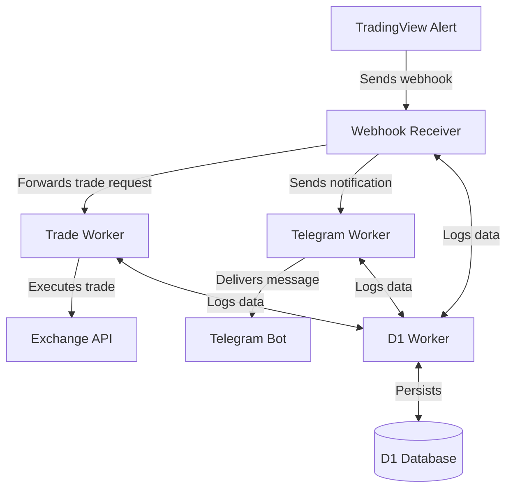

# Crypto Trading System with Cloudflare Workers

[](https://bun.sh)
[](https://workers.cloudflare.com/)
[](https://developers.cloudflare.com/d1/)
[](https://github.com/yourusername/hoox-trading/graphs/commit-activity)
[](https://opensource.org/licenses/MIT)

> A secure, high-performance automated trading system that executes cryptocurrency hoox trading strategies using serverless Cloudflare Workers. The system processes TradingView alerts through a webhook system, executes trades on cryptocurrency exchanges, and provides real-time notifications via Telegram.

## 🔍 Overview

This project implements a secure, serverless trading system using Cloudflare Workers to execute trades on cryptocurrency exchanges based on signals from TradingView alerts.

## 🚀 Platform Requirements

This system is specifically designed for and requires Cloudflare Workers due to its use of Cloudflare-specific features:
- **D1 Database**: Used for logging and data persistence
- **Workers KV**: For caching and state management
- **Workers Secrets**: For secure credential management
- **Service bindings**: For secure worker-to-worker communication

While other serverless platforms like Vercel Edge Functions or AWS Lambda offer similar capabilities, porting this system would require significant architectural changes and loss of key features.

## 🏗️ Architecture

The system consists of four main components:

1. **Webhook Receiver**: Public-facing endpoint that receives TradingView webhook signals, validates them, and forwards to the appropriate workers
2. **Trade Worker**: Internal service that executes trades on cryptocurrency exchanges (Binance, MEXC, Bybit)
3. **Telegram Worker**: Internal service that sends notifications via Telegram
4. **D1 Worker**: Database service for logging and data persistence

### Communication Flow



## 📋 Prerequisites

- Cloudflare account
- Node.js and npm
- [Bun](https://bun.sh) (for package management)
- Wrangler CLI (`npm install -g wrangler` or `bun install -g wrangler`)
- Cloudflare API Token with "Edit Workers" permission

## 🔑 Cloudflare API Token Setup

Before deploying or running the scripts, you'll need to create and configure a Cloudflare API token:

1. **Create an API Token**:
   - Go to your Cloudflare dashboard: [https://dash.cloudflare.com/profile/api-tokens](https://dash.cloudflare.com/profile/api-tokens)
   - Click "Create Token"
   - Choose "Create Custom Token"
   - Set the token name (e.g., "Workers Management")
   - Add the following permissions:
     - Account > Worker Scripts > Edit
     - Account > Workers KV Storage > Edit
     - Account > Workers D1 > Edit (if using D1 database)
   - Set appropriate Zone Resources (typically "All zones")
   - Click "Continue to Summary" and then "Create Token"
   - **IMPORTANT**: Save the displayed token value securely - it won't be shown again

2. **Configure the Token for Wrangler**:

   Option A: Set as environment variable (recommended for CI/CD and local use):
   ```bash
   # Add to your shell profile (.bashrc, .zshrc, etc.) for persistence
   export CLOUDFLARE_API_TOKEN=your_token_here
   ```

   Option B: Add to wrangler.toml (NOT recommended for shared repositories):
   ```toml
   # In each worker's wrangler.toml file
   [vars]
   # Other vars...

   # DO NOT commit this file to public repositories if using this method
   [env.production]
   CLOUDFLARE_API_TOKEN = "your_token_here"
   ```

   Option C: Configure in Wrangler CLI (stores token encrypted):
   ```bash
   wrangler config
   # Follow prompts to enter your API token
   ```

3. **Verify the Token is Working**:
   ```bash
   wrangler whoami
   ```
   
   You should see your Cloudflare account details if the token is valid.

## 🛠️ Helper Scripts

The project includes several utility scripts to simplify the setup, configuration, and deployment processes:

### Setup Scripts

| Script | Description |
|--------|-------------|
| `./scripts/setup-secrets.sh` | Interactive script to configure all worker secrets for both local and production environments |
| `./scripts/setup-worker-domains.sh` | Sets up custom domains for your worker endpoints |

### API Key Management

| Script | Description |
|--------|-------------|
| `./scripts/update-api-key.sh` | Update the webhook API key in production |
| `./scripts/update-local-api-key.sh` | Update the webhook API key for local development |
| `./scripts/update-service-key.sh` | Update the internal service authentication key in production |
| `./scripts/update-local-service-key.sh` | Update the internal service authentication key for local development |
| `./scripts/generate-api-key.sh` | Generate a new secure API key |
| `./scripts/keys.sh` | Core utility for secure key management |

### URL Management

| Script | Description |
|--------|-------------|
| `./scripts/update-urls.sh` | Update worker URLs in production configuration |
| `./scripts/update-local-urls.sh` | Update worker URLs for local development |

### Development & Deployment

| Script | Description |
|--------|-------------|
| `./scripts/deploy-all.sh` | Build and deploy all workers to production |
| `./scripts/dev-start.sh` | Start all worker services in development mode |
| `./scripts/control-panel.sh` | Interactive management dashboard for the project |

## 🚀 Deployment Options

### Quick Deploy (Individual Workers)

Deploy each worker to your Cloudflare account with one click:

| Worker | Deploy Button |
|--------|--------------|
| D1 Worker | [](https://deploy.workers.cloudflare.com/?url=https://github.com/yourusername/hoox-trading/tree/main/workers/d1-worker) |
| Trade Worker | [](https://deploy.workers.cloudflare.com/?url=https://github.com/yourusername/hoox-trading/tree/main/workers/trade-worker) |
| Webhook Receiver | [](https://deploy.workers.cloudflare.com/?url=https://github.com/yourusername/hoox-trading/tree/main/workers/webhook-receiver) |
| Telegram Worker | [](https://deploy.workers.cloudflare.com/?url=https://github.com/yourusername/hoox-trading/tree/main/workers/telegram-worker) |

### Alternative Deployment Methods

1. **Cloudflare Dashboard**
   ```bash
   # Build workers
   cd webhook-receiver && bun run build
   cd ../trade-worker && bun run build
   cd ../telegram-worker && bun run build
   cd ../d1-worker && bun run build
   
   # Upload the built workers through the Cloudflare Dashboard
   # https://dash.cloudflare.com/?to=/:account/workers/overview
   ```

2. **Wrangler CLI (Recommended for Teams/Enterprise)**
   ```bash
   # Deploy all workers with environment configuration
   ./scripts/deploy-all.sh
   ```

## 📦 Installation

Follow these steps to set up the project:

1. **Clone the repository**
   ```bash
   git clone https://github.com/yourusername/hoox-trading.git
   cd hoox-trading
   ```

2. **Install dependencies**
   ```bash
   # Install Bun if you haven't already
   curl -fsSL https://bun.sh/install | bash
   
   # Install dependencies for all workers
   cd webhook-receiver && bun install
   cd ../trade-worker && bun install
   cd ../telegram-worker && bun install
   cd ../d1-worker && bun install
   cd ..
   ```

3. **Configure secrets and settings**
   ```bash
   # Set up secrets for all workers (interactive)
   ./scripts/setup-secrets.sh
   
   # Or use the automated setup with defaults for CI/CD
   CLOUDFLARE_API_TOKEN=your_token ./scripts/setup-secrets.sh --non-interactive
   ```

4. **Create a D1 database**
   ```bash
   cd d1-worker
   wrangler d1 create hoox-trading-db
   cd ..
   ```

5. **Update database ID**
   
   Update the `database_id` in `d1-worker/wrangler.toml` with the ID returned from the previous command.

6. **Deploy all workers**
   ```bash
   ./scripts/deploy-all.sh
   ```

7. **Set up worker domains** (optional)
   ```bash
   ./scripts/setup-worker-domains.sh
   ```

## 🧪 Testing

The project uses Bun's test runner for unit and integration testing. Tests are now organized within each worker's directory structure.

### Test Structure

Each worker contains its own tests in the following structure:
```
workers/
  ├── webhook-receiver/
  │   ├── src/
  │   └── test/
  │       ├── webhook-receiver.test.ts
  │       ├── setup.ts
  │       └── types.d.ts
  ├── trade-worker/
  │   ├── src/
  │   └── test/
  │       ├── trade-worker.test.ts
  │       ├── setup.ts
  │       └── types.d.ts
  └── ...
```

### Running Tests

You can run tests from the root of the project or individually within each worker:

#### Central Test Management

From the project root:
```bash
# Run all tests
bun run test

# Run tests with watch mode
bun run test:watch

# Run tests with coverage
bun run test:coverage
```

#### Individual Worker Testing

You can also run tests for a specific worker:
```bash
cd workers/webhook-receiver
bun test

# With coverage
bun test --coverage
```

### Writing New Tests

When adding new functionality, please also add corresponding tests. Each test file should:

1. Import the worker module
2. Mock external dependencies
3. Test both success and error cases

Example:
```typescript
import { describe, expect, test, beforeEach, mock } from "bun:test";
import myWorker from "../src/index.js";

describe("My Worker", () => {
  // Test setup
  beforeEach(() => {
    // Mock external dependencies
  });

  test("should handle valid input", async () => {
    // Test code here
  });
});
```

## 🔧 Local Development

Local development requires running all workers on separate ports to avoid conflicts:

| Worker | Development Port |
|--------|-----------------|
| d1-worker | 8787 |
| trade-worker | 8788 |
| webhook-receiver | 8789 |
| telegram-worker | 8790 |

### Terminal User Interface (TUI)

The project includes a modern Terminal User Interface with a clean, code-system design for managing workers:

```bash
# Run the TUI with explicit stdin
exec < /dev/tty
bun run tui
```

> **Note:** The TUI requires an interactive terminal with proper stdin access. Run it directly in your terminal, not in a CI/CD pipeline or background process.

For non-interactive environments or quick status checks, use:

```bash
# Check worker status without interactive UI
bun run status
```

The clean-design TUI provides:

- **Workers List**: View status of all workers with color-coded indicators
- **Worker Details**: Control panel for individual worker management
- **Real-time Logs**: View logs for the selected worker
- **System Overview**: Quick stats on running/stopped worker counts
- **Global Actions**: Commands that affect all workers at once
- **Keyboard Navigation**: Easily switch between panels and control workers


#### Keyboard Shortcuts

| Key | Action |
|-----|--------|
| ↑/↓ | Navigate worker list |
| Tab | Cycle focus between panels |
| s | Start selected worker |
| k | Stop (kill) selected worker |
| r | Restart selected worker |
| S | Start all workers |
| K | Stop all workers |
| R | Restart all workers |
| q or Ctrl+Q | Exit application |

### Environment Variables

For local development, environment variables are loaded from `.dev.vars` files in each worker directory. Example `.dev.vars` file for the trade-worker:

```